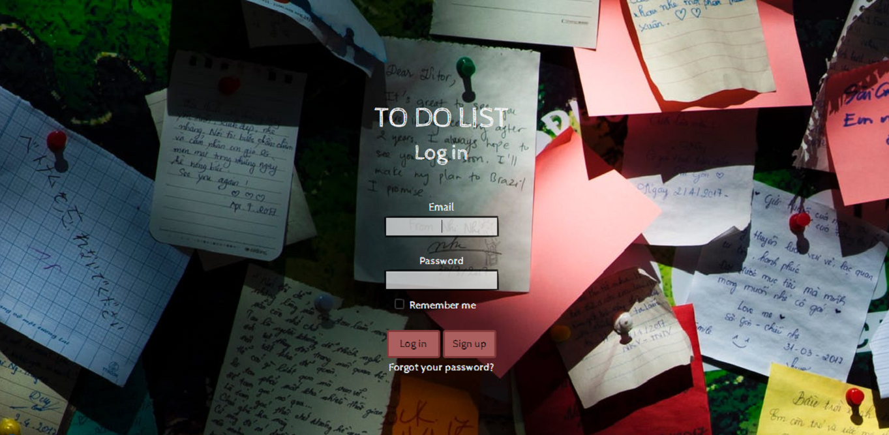
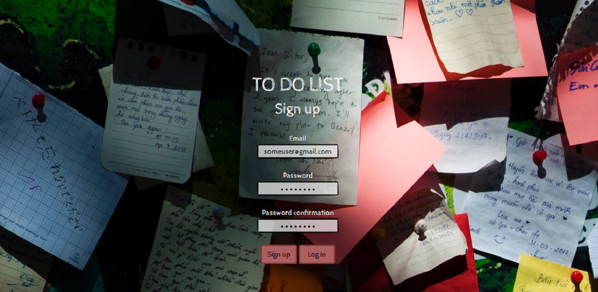
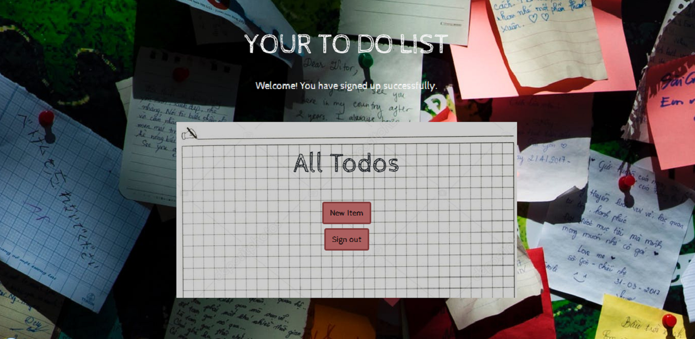
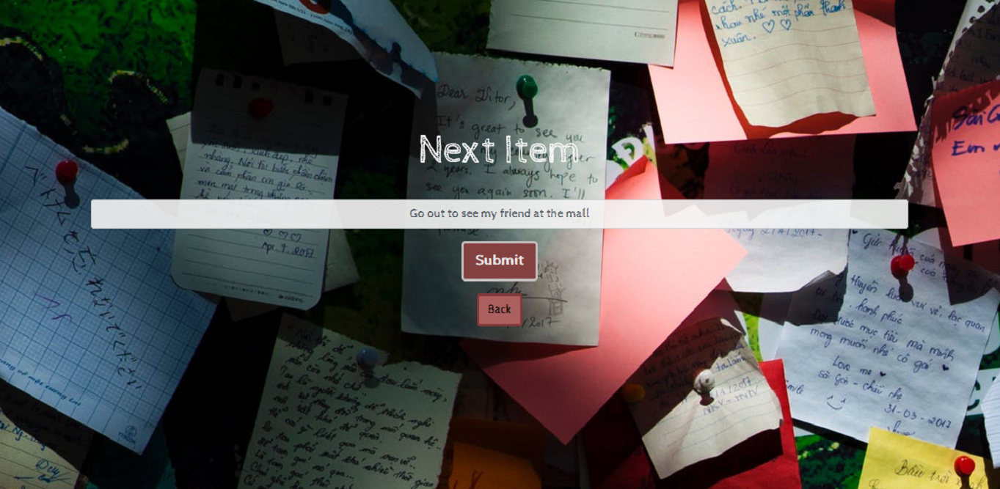
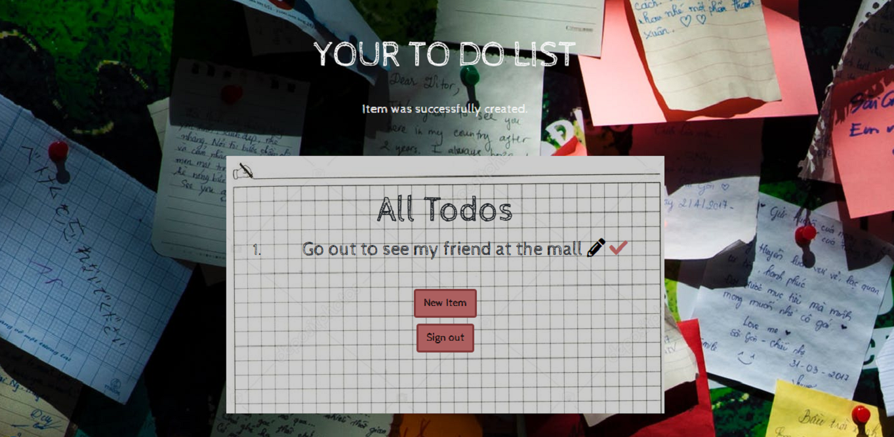
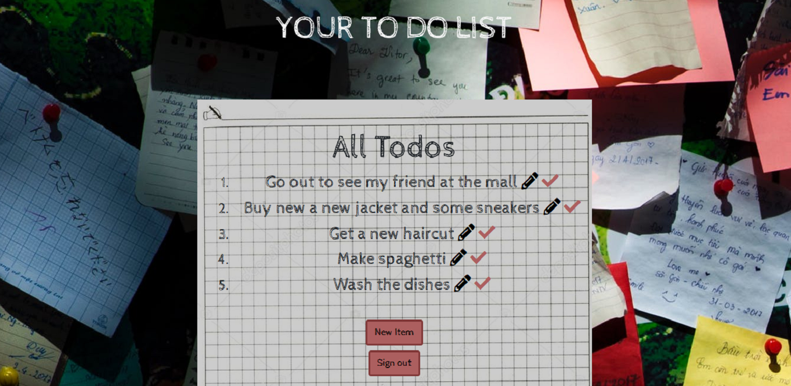

To-do List
=================
A to-do list application created in Ruby on Rails. Users can create an account,
sign in and add items to their own to-do list.
The items on the list can be easily removed and modified.
This application uses database as well as user authentication system.

Tools and technologies used:

* Ruby on Rails
* Devise
* PostgreSQL
* HTML / CSS
* Bootstrap

-----

|   Description    |   Image    |
|:------------:|:----------------:|
|User can sign in| |
|User can sign up| |
|Each user has his own list| |
|User can add items to the list| |
|User's items appear on the list| |
|All user's items are enumerated| |
|Each item can be edited or removed| |

-----

**Heroku**
-------------------------------
This app has been deployed to Heroku:

https://github.com/MarcinBalejko/todo-list-rails

-------
